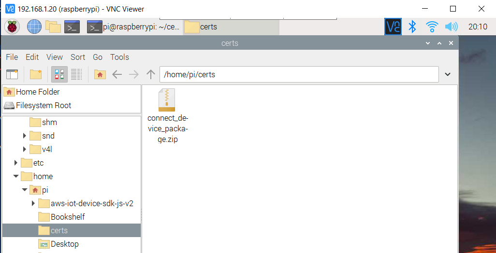

# Data Ingestion from Raspberry PI into AWS IOT

## Objective
---

Objective of this exercise is to learn how to send data from Raspberry PI or other devices to AWS IOT Core

## Pre-Requisities

1. AWS Subscription and access to AWS IOT / Administrator access.
2. Raspberry PI with Raspberry PI OS installed and connected to Internet through Wifi.
3. Following commands already run on Raspberry PI to install nodejs, git and AWS Common Runtime library and AWS IOT Device SDK.
    
        sudo apt-get install cmake
        sudo apt-get install libssl-dev
        git --version
        sudo apt-get install git
        cd ~
        curl -sL https://deb.nodesource.com/setup_12.x | sudo -E bash -
        sudo apt-get install -y nodejs
        node -v
        sudo shutdown -r 0
        cd ~
        npm install aws-crt        
        npm install aws-iot-device-sdk-v2
        cd ~
        git clone https://github.com/aws/aws-iot-device-sdk-js-v2.git
        cd ~/aws-iot-device-sdk-js-v2
        npm install

## Steps
---

### AWS IOT Core

1. Login to AWS Console and open AWS IOT Core service
2. Select View Connection Options

   
3. Select Onboard device

   

4. Create a thing
   
   

   

5. Download connect kit files

   

6. Copy the downloaded connection kit file to Raspberry PI

    

    

7. Run the following commands on PI -

   

8. Check messages being sent from pub sub application and received from IOT Core

   

9. Check messages being sent from pub sub application and sent from PI

   

10. Connection from Raspberry PI to AWS IOT Core is successful and we are able to send message from Raspberry PI to AWS IOT Core and from AWS IOT Core to Raspberry PI.

   